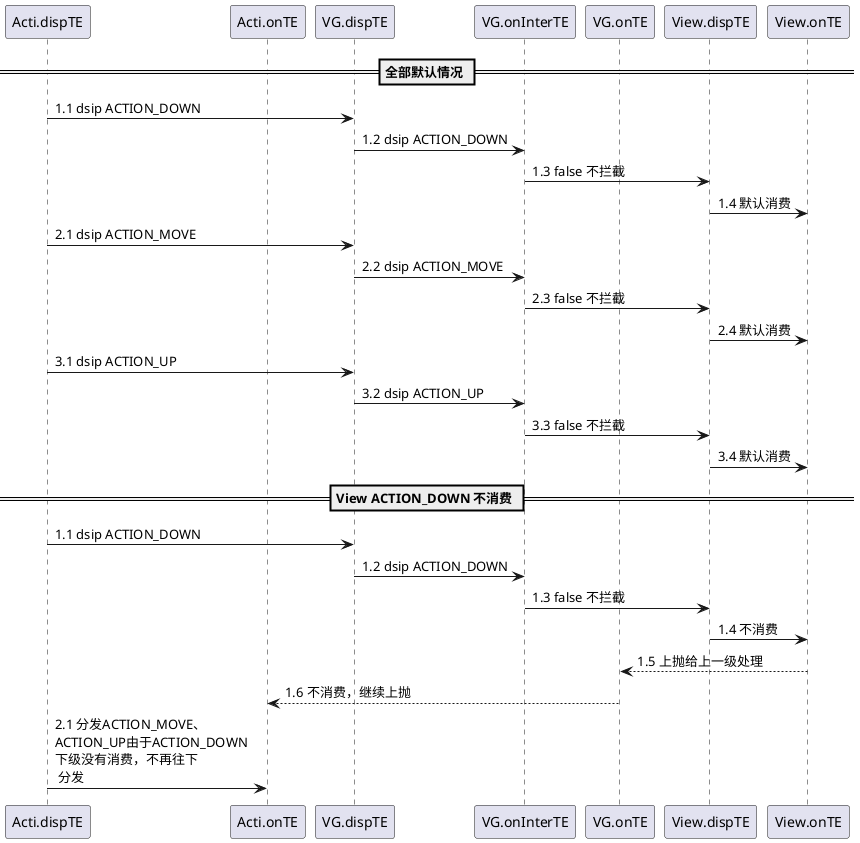

# View 的事件体系

## View 的位置参数
View 的位置和父容器的关系


相对父布局的坐标参数：left、top、right、bottom。
其中，View 左上角的坐标：x、y。
View 左上角相对于父布局的偏移量：translationX、translationY

他们间的关系如下：
```
x = left + translationX
y = top + translationY
```

注意： view 发生平移的过程中， left、top 其值并没有发生变化，发生变化的是 x，y，translationX，translationY。

## 	MotionEvent和TouchSlop
**MotionEvent：**
* 手触摸手机屏后会发生一个 ACTION_DOWN、多个 ACTION_MOVE、一个 ACTION_UP 事件。
* 通过 MotionEvent 对象我们可以得到事件发生的 x 和 y 坐标，我们可以通过 getX/getY 和 getRawX/getRawY 得到。

&emsp;&emsp;其中，getX/getY 返回的是相对于当前 View 左上角的 x 和 y 坐标，而 getRawX/getRawY 返回的是相对于手机屏幕左上角的 x 和 y 的坐标。

**TouchSloup：**
TouchSloup 是系统所能识别出的被认为是滑动的最小距离，这是一个常量，与设备有关，可通过以下方法获得：
```java
ViewConfiguration.get(getContext()).getScaledTouchSloup().
```

## View 相关的重要类
**VelocityTracker**
速度追踪，用于追踪手指在滑动过程中的速度，包括水平和竖直方向的速度。
使用如下：
1. View 的 onTouchEvent 方法中追踪当前单击事件的速度。

```java
VelocityRracker velocityTracker = VelocityTracker.obtain();
velocityTracker.addMovement(event);
```
2. 计算速度，获得水平速度和垂直速度。

```java
velocityTracker.computeCurrentVelocity(1000);
 int xVelocity = (int) velocityTracker.getXVelocity();
 int yVelocity = (int) velocityTracker.getYVelocity();
```
注意，获取速度之前必须先计算速度，即调用 computeCurrentVelocity 方法，这里指 的速度是指一段时间内手指滑过的像素数，1000 指的是 1000 毫秒，得到的是 1000 毫 秒内滑过的像素数。速度可正可负：
```
速度	=	（终点位置	-	起点位置）	/	时间段
```
3. 不需要时，回收调用 clear() 方法重置并回收内存。

<br/>

**GestureDetetor**
手势检测，用于辅助检测用户的单击、滑动、长按、双击等行为。

1. 创建一个 GestureDetector 对象并实现 OnGestureListener 接口，根据需要，也可实现 OnDoubleTapListener 接口从而监听双击行为：

```java
GestureDetector mGestureDetector = new GestureDetector(this);
// 解决长按屏幕后无法拖动的现象
mGestureDetector.setIsLongpressEnabled(false);
```
2. 接管目标 View 的 onTouchEvent 方法，在待监听 View 的 onTouchEvent 方法中添加如下实现：

```java
boolean consume = mGestureDetector.onTouchEvent(event);
return consume;
```
3. 方法介绍：


<br/>

**Scroller**
弹性滑动的对象，用于实现 View 的弹性滑动。Scroller 本身无法让 View 弹性滑动，它需要和 View 的 computeScroll 方法配合才可以共同完成这功能。

## View 的滑动
**使用 scrolTo/scrollBy**

原理是改变内容相对于 View 自身位置，其中 mScrollX 的值 View 左边缘和 View 内容左边缘的距离。mScrollY 同理。
```
mScrollX = View 自身位置左边缘 - View 内容位置的左边缘
mScrollY = View 自身位置顶边缘 - View 内容位置的顶边缘
```
具体如下图：


**内容区**
这里说到内容区插个题外话，`canvas.clipRect(int left, int top, int right, int bottom) ` 画布裁剪的是内容区和 View 位置是无关的。

**使用动画：** 操作简单可[参考](https://wiki.jikexueyuan.com/project/android-animation/3.html)

**改变布局参数**
```java
LayoutParams params = this.getLayoutParams();
params.leftMargin += 100;
params.width += 100;
this.requestLayout();
//        或
//        this.setLayoutParams(params);
```

**总结：**
* scrollTo/scrollBy：操作简单，适合对于 View 内容的滑动。
* 动画：操作简单，主要用于没有交互的 View 和实现复杂的动画效果。
* 改变布局参数：操作稍微复杂，适用于有交换的 View。

## 弹性滑动
**使用Scroller：** 原理是 startScroll 记录滑动的初始状态和设置末尾状态；computeScrollOffset 通过时间流逝，计算当前位置。而 View 绘制前会调用 View.computeScroll 方法，通过 View.scrollTo 从 Scroller 中不断拿出新位置刷新内容位置实现移动，然后再次触发绘制，巧妙地进入循环。

```java
private void smoothScrollTo(int destX, int destY) {
    int scrollX = getScrollX();
    int dx = destX - scrollX;
    mScroller.startScroll(scrollX, 0, dx, 0, 1000);
    invalidate();
}

@Override
public void computeScroll() {
    if (mScroller.computeScrollOffset()) {
        scrollTo(mScroller.getCurrX(), mScroller.getStartY());
        postInvalidate();
    }
}
```

```java
public boolean computeScrollOffset() {
            ...
        int timePassed = (int) (AnimationUtils.currentAnimationTimeMills() - mStartTi me);
        if (timePassed < mDuration) {
            switch (mMode) {
                case SCROLL_MODE:
                    final float x = mInterpolator.getInterpolation(timePassed * mDuratio nReciprocal); mCurrX = mStartX + Math.round(x * mDeltaX);
                    mCurrY = mStartY + Math.round(y * mDeltaY);
                    ...
            }
            break;
        } return true;
    }
```

**使用动画：** 通过 ValueAnimator 计算，也可以移动内容实现。

```java
final int startX = 0;
final int deltaX = 100;
ValueAnimator animator = ValueAnimator.ofInt(0, 1).setDuration(1000);
animator.addUpdateListener(new AnimatorUpdateListener() {
    @override
    public void onAnimationUpdate(ValueAnimator animator) {
        float fraction = animator.getAnimatedFraction();
        mButton1.scrollTo(startX + (int) (deltaX * fraction), 0);
    }
});
animator.start();
```

**使用延长策略：** 核心是通过 Handler 的消息循环。

```java
private static final int MESSAGE_SCROLL_TO = 1;
private static final int FRAME_COUNT = 30;
private static final int DELATED_TIME = 33;
private int mCount = 0;
@suppressLint("HandlerLeak")
private Handler handler = new handler() {
    public void handleMessage(Message msg) {
        switch (msg.what) {
            case MESSAGE_SCROLL_TO:
                mCount++;
                if (mCount <= FRAME_COUNT) {
                    float fraction = mCount / (float) FRAME_COUNT;
                    int scrollX = (int) (fraction * 100);
                    mButton1.scrollTo(scrollX, 0);
                    mHandelr.sendEmptyMessageDelayed(MESSAGE_SCROLL_TO, DELAYED _TIME);
                } break;
            default:
                break;

        }
    }
}
}
```

## MotionEvent 分发过程

点击事件的分发过程有三个很重要的方法共同完成：dispatchTouchEvent、onInterceptTouchEvent、onTouchEvent。

| 方法 | 描述 | 其他 |
| ---- | ----| ---- |
| boolean dispatchTouchEvent(MotionEvent ev) | 表示是否消耗当前事件。<br/> 如果事件传递到当前的view，则该方法必定调用。返回的结果受当前View的 onTouchEvent 和下级View 的dispatchTouchEvent方法的影响。| 都有 |
| boolean onInterceptTouchEvent(MotionEvent ev) | 返回结果表示是否拦截当前事件 | ViewGroup 默认返回 false,View，Activity 没有该方法，直接调用View onTouchEvent方法 |
| boolean onTouchEvent(MotionEvent ev) | 返回结果表示是否消耗当前事件 | View 默认返回true ,除非不可点击 |

三者的关系可以用以下伪代码表示：

```java

// 事件分发到当前view
public boolean dispatchTouchEvent(MotionEvent ev) {
      boolean consume = false;
        // 是否拦截当前事件
      if (onInterceptTouchEvent(ev)) {
            // 是否消费当前事件
          consume = onTouchEvent(ev);
      } else {
            // 分发给子控件
          consume = child.dispatchTouchEvent(ev);
        }

      return consume;
}
```

其中，事件传递的过程中，如果 View 设置了 OnTouchListener ,那么方法中的 onTouch 方法会被调用，如果该方法返回false ，则 onTouchEvent 方法被调用，反之 onTouchEvent 方法不被调用。故 onTouch 方法的优先级高于 onTouchEvent。
<br/>



* 内部拦截法：内部拦截法指父容器不拦截任何事件，所有事件传递给子元素，如果子元素需要此事件就直接消耗掉，否则由父容器进行处理。需要配合 requestDisallowInterceptTouchEvent 方法才能正常工作。伪代码如下：

```java
public boolean dispatchTouchEvent(MotionEvent event) {
    int x = (int) event.getX();
    int y = (int) event.getY();
    switch (event.getAction) {
        case MotionEvent.ACTION_DOWN:
            parent.requestDisallowInterceptTouchEvent(true);
            break;
        case MotionEvent.ACTION_MOVE:
            int deltaX = x - mLastX;
            int deltaY = y - mLastY;
            if (父容器需要此类点击事件) {
                parent.requestDisallowInterceptTouchEvent(false);
            }
            break;
        case MotionEvent.ACTION_UP:
            break;
        default:
            break;
    }
    mLastX = x;
    mLastY = y;
    return super.dispatchTouchEvent(event);
}
```

除了子元素需要处理外，父容器也要默认拦截除了 ACTION_DOWN 以外的其他事件，这样当子元素调用 parent.requestDisallowInterceptTouchEvent(false) 方法时，父容器才能继续拦截所需要的事件。因此，父容器需要修改如下：

```java
public boolean onInterceptTouchEvent(MotionEvent event) {
    int action = event.getAction();
    if (action == MotionEvent.ACTION_DOWN) {
        return false;
    } else {
        return true;
    }
}
```
