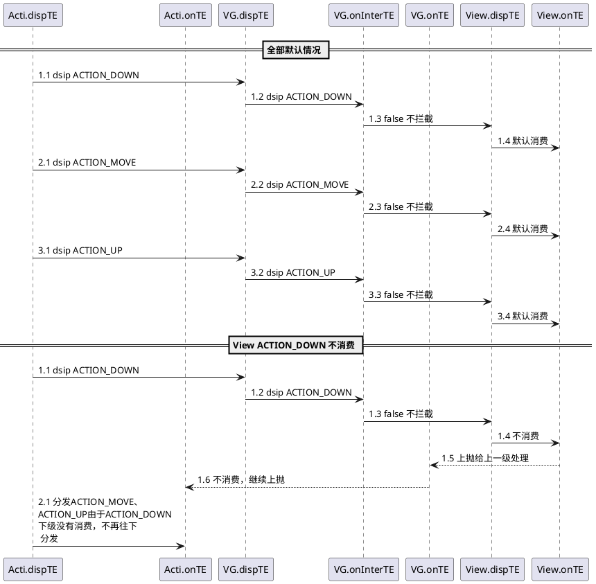

# View 的事件体系

## View 的位置参数
View 的位置和父容器的关系


相对父布局的坐标参数：left、top、right、bottom。
其中，View 左上角的坐标：x、y。
View 左上角相对于父布局的偏移量：translationX、translationY

他们间的关系如下：
```
x = left + translationX
y = top + translationY
```

注意： view 发生平移的过程中， left、top 其值并没有发生变化，发生变化的是 x，y，translationX，translationY。

## 	MotionEvent和TouchSlop
**MotionEvent：**
* 手触摸手机屏后会发生一个 ACTION_DOWN、多个 ACTION_MOVE、一个 ACTION_UP 事件。
* 通过 MotionEvent 对象我们可以得到事件发生的 x 和 y 坐标，我们可以通过 getX/getY 和 getRawX/getRawY 得到。

&emsp;&emsp;其中，getX/getY 返回的是相对于当前 View 左上角的 x 和 y 坐标，而 getRawX/getRawY 返回的是相对于手机屏幕左上角的 x 和 y 的坐标。

**TouchSloup：**
TouchSloup 是系统所能识别出的被认为是滑动的最小距离，这是一个常量，与设备有关，可通过以下方法获得：
```
ViewConfiguration.get(getContext()).getScaledTouchSloup().
```


## View 相关的重要类
* VelocityTracker
* GestureDetetor
* Scroller

## MotionEvent 分发过程

点击事件的分发过程有三个很重要的方法共同完成：dispatchTouchEvent、onInterceptTouchEvent、onTouchEvent。

| 方法 | 描述 | 其他 |
| ---- | ----| ---- |
| boolean dispatchTouchEvent(MotionEvent ev) | 表示是否消耗当前事件。<br/> 如果事件传递到当前的view，则该方法必定调用。返回的结果受当前View的 onTouchEvent 和下级View 的dispatchTouchEvent方法的影响。| 都有 |
| boolean onInterceptTouchEvent(MotionEvent ev) | 返回结果表示是否拦截当前事件 | ViewGroup 默认返回 false,View，Activity 没有该方法，直接调用View onTouchEvent方法 |
| boolean onTouchEvent(MotionEvent ev) | 返回结果表示是否消耗当前事件 | View 默认返回true ,除非不可点击 |

三者的关系可以用以下伪代码表示：

```java

// 事件分发到当前view
public boolean dispatchTouchEvent(MotionEvent ev) {
      boolean consume = false;
        // 是否拦截当前事件
      if (onInterceptTouchEvent(ev)) {
            // 是否消费当前事件
          consume = onTouchEvent(ev);
      } else {
            // 分发给子控件
          consume = child.dispatchTouchEvent(ev);
        }

      return consume;
}
```

其中，事件传递的过程中，如果 View 设置了 OnTouchListener ,那么方法中的 onTouch 方法会被调用，如果该方法返回false ，则 onTouchEvent 方法被调用，反之 onTouchEvent 方法不被调用。故 onTouch 方法的优先级高于 onTouchEvent。
<br/>


public boolean onInterceptTouchEvent(MotionEvent event) {
    boolean intercepted = false;
    int x = (int) event.getX();
    int y = (int) event.getY();
    switch (event.getAction()) {
        case MotionEvent.ACTION_DOWN:
            intercepted = false;
            break;
        case MotionEvent.ACTION_MOVE:
            if (父容器需要当前事件）{
            intercepted = true;
        }	else{
            intercepted = flase;
        }
        break;
        case MotionEvent.ACTION_UP:
            intercepted = false;
            break;
        default:
            break;
    }

    mLastXIntercept = x;
    mLastYIntercept = y;
    return intercepted;
}
```

* 内部拦截法：内部拦截法指父容器不拦截任何事件，所有事件传递给子元素，如果子元素需要此事件就直接消耗掉，否则由父容器进行处理。需要配合 requestDisallowInterceptTouchEvent 方法才能正常工作。伪代码如下：

```
public boolean dispatchTouchEvent(MotionEvent event) {
    int x = (int) event.getX();
    int y = (int) event.getY();
    switch (event.getAction) {
        case MotionEvent.ACTION_DOWN:
            parent.requestDisallowInterceptTouchEvent(true);
            break;
        case MotionEvent.ACTION_MOVE:
            int deltaX = x - mLastX;
            int deltaY = y - mLastY;
            if (父容器需要此类点击事件) {
                parent.requestDisallowInterceptTouchEvent(false);
            }
            break;
        case MotionEvent.ACTION_UP:
            break;
        default:
            break;
    }
    mLastX = x;
    mLastY = y;
    return super.dispatchTouchEvent(event);
}
```

除了子元素需要处理外，父容器也要默认拦截除了 ACTION_DOWN 以外的其他事件，这样当子元素调用 parent.requestDisallowInterceptTouchEvent(false) 方法时，父容器才能继续拦截所需要的事件。因此，父容器需要修改如下：

```
public boolean onInterceptTouchEvent(MotionEvent event) {
    int action = event.getAction();
    if (action == MotionEvent.ACTION_DOWN) {
        return false;
    } else {
        return true;
    }
}
```
